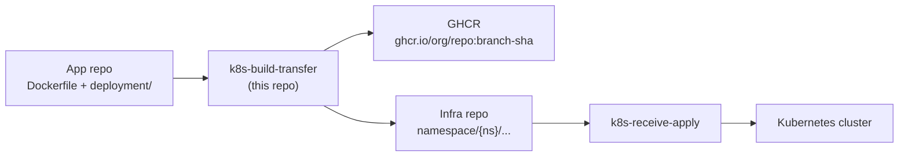

# Agent Instructions — k8s-build-transfer

This repository is **half of a two-action GitOps pipeline**. It never deploys to Kubernetes itself. Changes here must stay compatible with the sibling repo **k8s-receive-apply**, which applies manifests written by this action.

**Sibling repo:** `../k8s-receive-apply` (or `fantasyflip/k8s-receive-apply` on GitHub)

---

## System overview



| Phase | Repo | Trigger | Output |
|-------|------|---------|--------|
| Build & transfer | **k8s-build-transfer** (this) | Push to app repo | Docker image on GHCR + commits to infra repo |
| Apply | k8s-receive-apply | Push to infra repo (`[CI]` in message) | `kubectl apply` to cluster |

---

## This repo's responsibility

**k8s-build-transfer** is a composite GitHub Action that:

1. Builds an **ARM64** Docker image and pushes it to **GHCR** (`ghcr.io/{repo}:{branch}-{sha}`)
2. Patches `deployment.json` in the app repo with the new image URL (commit with `[skip ci]`)
3. Copies pod manifests from the app repo to the infra repo
4. Manages **namespace-level shared ingress** — merges new rules into `namespace/{namespace}/ingress.json`

### Entry point

- `action.yml` — orchestrates all steps; primary file for workflow changes

### Sub-actions (`actions/`)

| Action | Purpose |
|--------|---------|
| `checkIngress/` | Detect whether ingress exists in infra repo; copy if missing |
| `checkIngressDiff/` | Compare source vs infra ingress rules |
| `mergeIngress/` | Append new ingress rules; **fail on duplicate host** |
| `generateCommitMessage/` | Build tagged commit messages for infra repo |
| `generateImageUrl/` | Produce `ghcr.io/{repo}:{branch}-{sha}` |
| `updateImageUrl/` | Patch container image in `deployment.json` |

### Shared utilities

- `utils.js` — deep equality helpers for ingress diffing

---

## Cross-repo contract (do not break)

k8s-receive-apply depends on conventions defined here. Any change to these requires a coordinated update in both repos.

### Commit message tags

| Tag | Set by | Consumed by receive-apply |
|-----|--------|---------------------------|
| `[CI]` | All infra-repo commits | Workflow filter: `contains(message, '[CI]')` |
| `[N={namespace}]` | All infra-repo commits | Extracted as `RT_NAMESPACE` for `kubectl apply -n` |
| `[H={hostname}]` | New ingress commits only | Cloudflare DNS A record when `set-cf-dns: true` |

Example messages produced:

```
chore(k8s): Add ingress for my-app to namespace production from org/my-app [CI][N=production][H=app.example.com]
chore(k8s): Copy pod my-app from org/my-app to namespace production [CI][N=production]
```

### Infra repo layout (written by this action)

```
infra-repo/
└── namespace/
    └── {namespace}/
        ├── ingress.json              # shared per namespace
        └── {app-name}/
            ├── deployment.json       # must be JSON, not YAML
            └── service.yaml
```

### App repo layout (expected input)

```
app-repo/
├── Dockerfile
└── deployment/          # configurable via deployment-path input
    ├── ingress.json
    └── pod/
        ├── deployment.json
        └── service.yaml
```

### Runtime environment variables

| Variable | Set by | Used for |
|----------|--------|----------|
| `RT_INGRESS_EXISTS` | checkIngress | Conditional ingress logic |
| `RT_INGRESS_IDENTICAL` | checkIngressDiff | Skip merge when identical |
| `RT_CHANGES_MADE` | git diff step | Whether to commit ingress |
| `RT_NEW_HOST` | checkIngress / mergeIngress | `[H=...]` tag in commit message |
| `RT_COM_MSG` | generateCommitMessage | Infra ingress commit message |
| `RT_IMG_URL` | generateImageUrl | Docker tag and deployment patch |

---

## When making changes

### Always consider the sibling repo

- Changing commit message format → update `generateCommitMessage/` **and** namespace/hostname parsing in k8s-receive-apply `action.yml`
- Changing infra repo paths → update `commit-file-pattern` default in receive-apply
- Adding new manifest types → ensure receive-apply's changed-files pattern includes them
- Changing image URL format → verify `updateImageUrl/` and that GHCR pull secrets still work

### Code conventions

- **Node.js 16** for sub-actions; composite steps use **bash**
- Only dependency: `@actions/core`
- Sub-actions are JavaScript actions in `actions/*/action.yml` + `*.js`
- Image builds are **linux/arm64 only** — use `ubuntu-24.04-arm` runners; QEMU is set up only when `runner.arch != 'ARM64'`
- Docker build uses `context: source` (consumer Dockerfiles must use standard `COPY` paths, not `COPY source/...`)
- Image tag format: `{branch}-{full-sha}` — not semver or `:latest`

### Known quirks (preserve or fix deliberately)

1. **Shared ingress per namespace** — multiple apps append rules; never overwrite the whole file
2. **Duplicate host protection** — `mergeIngress` errors if host exists with different rules
3. **Single infra commit** — ingress changes and pod manifests are committed together in one push to `infra-branch` (fixed in v1.3.0; previously `copy_folder` hardcoded `main`)
4. **Source repo round-trip** — `deployment.json` is committed back to app repo with `[skip ci]`

### Performance (v1.3.0)

- Docker build runs in the **background** while ingress steps execute
- **ARM64 runners** (`ubuntu-24.04-arm`) skip QEMU and build natively
- Dead steps removed: action-repo checkout, runner pnpm cache, `setup-node`, `npm install`
- Docker `context: source` — app `.dockerignore` applies; infra tree excluded from build context

### Testing

Integration test: `.github/workflows/test.yml`

- Runs only when commit message contains `!test`
- Uses `fantasyflip/k8s-copy-test` (infra) and `fantasyflip/nuxt-k8s-template` (source)

---

## What not to do

- Do not add Kubernetes apply logic here — that belongs in k8s-receive-apply
- Do not remove or rename `[CI]`, `[N=...]`, or `[H=...]` tags without updating receive-apply
- Do not change `namespace/` path structure without updating receive-apply's file pattern
- Do not convert `deployment.json` to YAML — receive-apply and this action expect JSON for deployments
